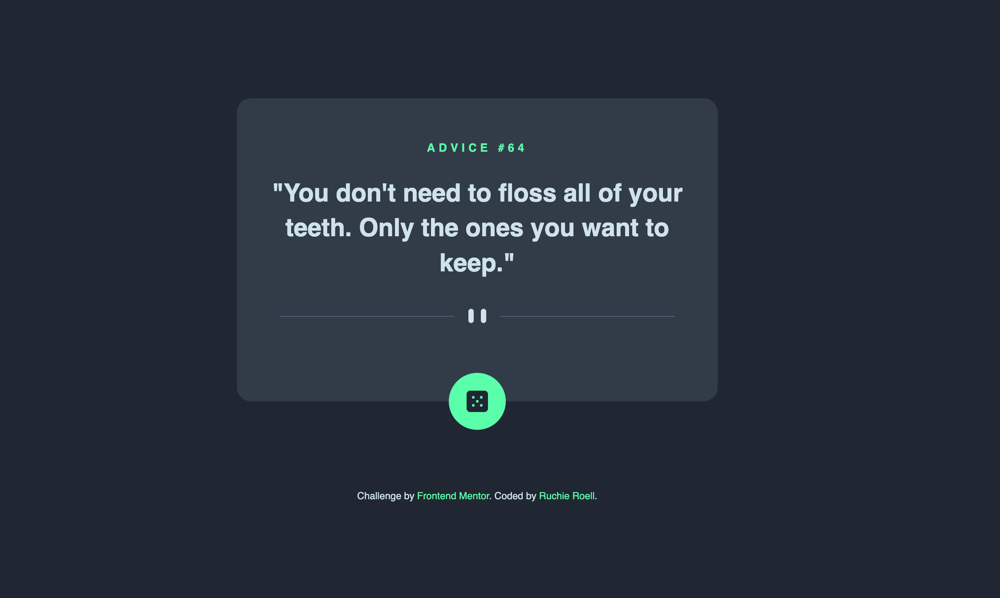

# Frontend Mentor - Advice Generator App Solution

This is a solution to the [Advice generator app challenge on Frontend Mentor](https://www.frontendmentor.io/challenges/advice-generator-app-QdUG-13db). Frontend Mentor challenges help you improve your coding skills by building realistic projects.

## Table of contents

- [Overview](#overview)
  - [The challenge](#the-challenge)
  - [Screenshot](#screenshot)
  - [Links](#links)
- [My process](#my-process)
  - [Built with](#built-with)
  - [What I learned](#what-i-learned)
  - [Useful resources](#useful-resources)
- [Author](#author)

## Overview

### The challenge

Users should be able to:

- View the optimal layout for the app depending on their device's screen size
- See hover states for all interactive elements on the page
- Generate a new piece of advice by clicking the dice icon

### Screenshot



### Links

- Solution URL: [Add your solution URL here]
- Live Site URL: [Add your live site URL here]

## My process

### Built with

- Semantic HTML5 markup
- CSS custom properties
- Flexbox
- Mobile-first workflow
- Vanilla JavaScript
- Advice Slip API

### What I learned

This project helped me strengthen my understanding of:

- Working with external APIs using fetch
- Handling asynchronous JavaScript with async/await
- Implementing loading states and error handling
- Creating responsive layouts with CSS
- Adding hover effects and transitions

Here are some code snippets I'm proud of:

```html
<!-- Clean, semantic HTML structure -->
<main class="advice-container">
  <h1 class="advice-number">ADVICE #<span id="advice-id"></span></h1>
  <p class="advice-text">
    "<span id="advice-content"></span>"
  </p>
</main>
```

```css
/* Smooth hover effect on the dice button */
.dice-button:hover {
  box-shadow: 0 0 40px var(--neon-green);
}
```

```js
// Clean error handling in async function
async function getAdvice() {
  try {
    const response = await fetch('https://api.adviceslip.com/advice', {
      cache: 'no-cache'
    });
    const data = await response.json();
    // Update the advice
  } catch (error) {
    console.error('Error fetching advice:', error);
    adviceContent.textContent = 'Failed to load advice. Please try again.';
  }
}
```

### Useful resources

- [MDN Web Docs](https://developer.mozilla.org) - Comprehensive documentation for HTML, CSS, and JavaScript
- [CSS-Tricks](https://css-tricks.com) - Great resource for CSS flexbox and positioning techniques
- [Advice Slip API](https://api.adviceslip.com) - The API documentation used in this project

## Author

- Github - [@ruefie](https://github.com/ruefie/Advice-Generator)
- Frontend Mentor - [@ruefie](https://www.frontendmentor.io/profile/ruefie)
